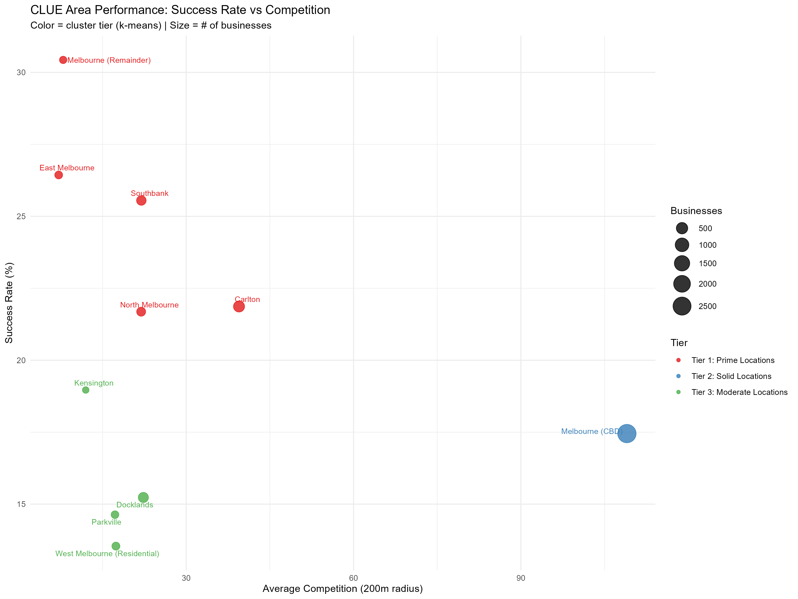
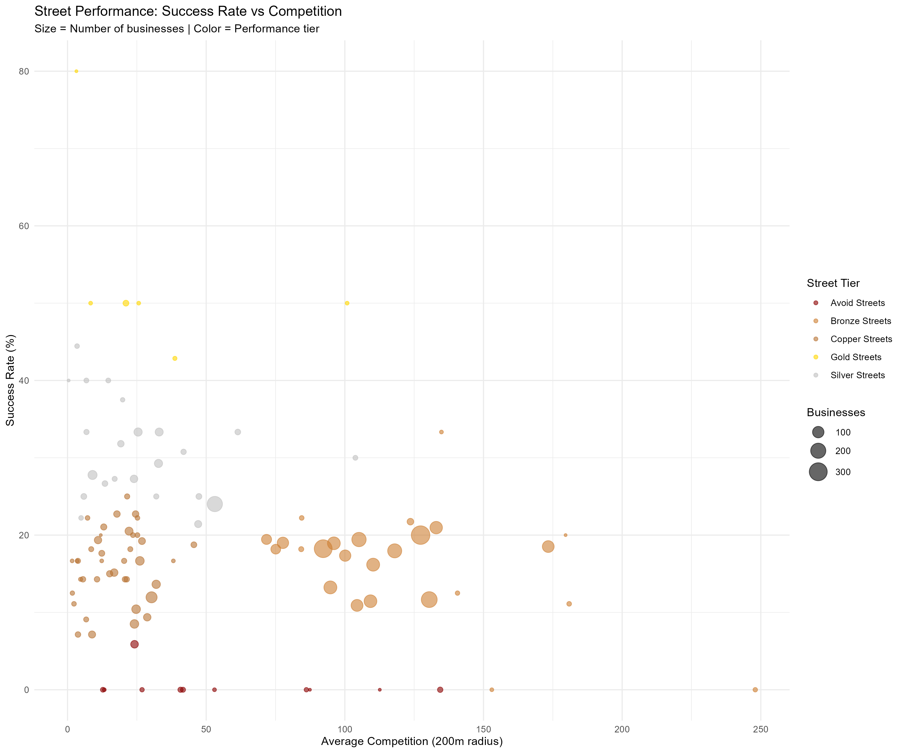
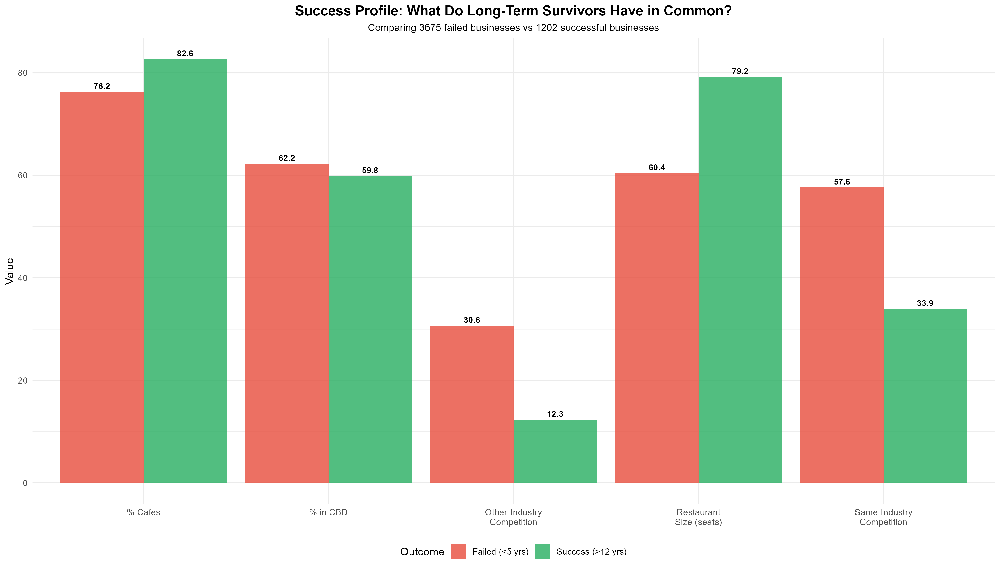
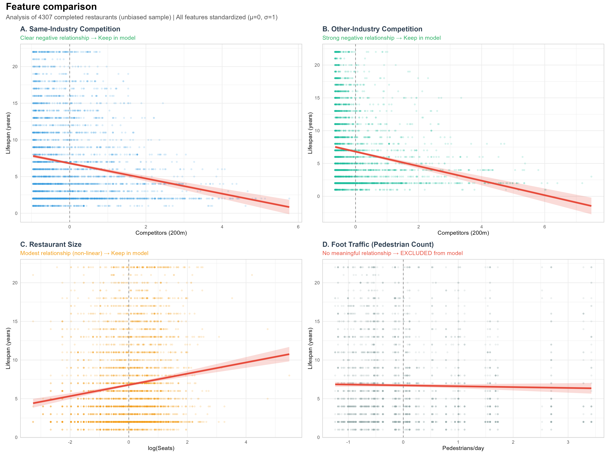
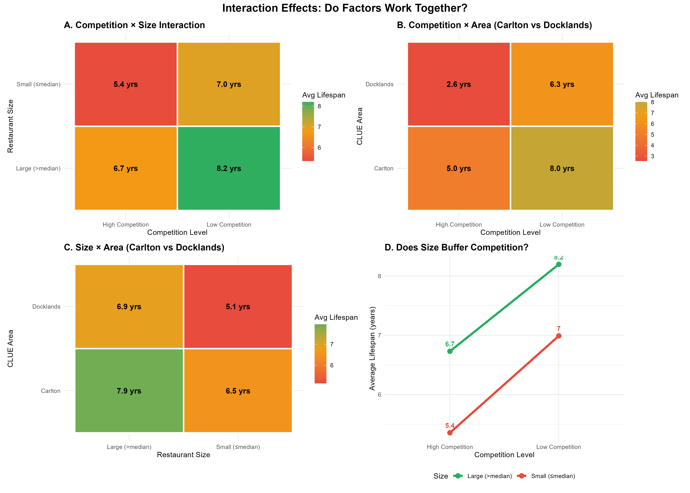

## Agenda {.smaller}

:::: columns
::: {.column width="100%"}
1.  The Project & Client Background
2.  Data Sources & Challenges
3.  Analytic Methods
4.  Key Findings
5.  Recommendations & Future Work
:::
::::

# The project {.section-slide background-color="#4A90E2"}

## OUR CONSULTING SCOPE {.smaller}

::::::::::: columns
:::: {.column width="23%"}
::: {.scope-box style="background-color: #FF8C69;"}
**OPERATIONAL EXCELLENCE:**

-   Workforce optimization
:::
::::

:::: {.column width="23%"}
::: {.scope-box style="background-color: #2D7A3D;"}
**SUPPLY CHAIN OPTIMIZATION:**

-   Logistics efficiency
:::
::::

:::: {.column width="23%"}
::: {.scope-box style="background-color: #4A9FD8;"}
**CENTRAL KITCHEN INNOVATION:**

-   Cost reduction
-   Quality consistency
:::
::::

:::: {.column width="23%"}
::: {.scope-box style="background-color: #8B4C94;"}
**STRATEGIC EXPANSION:**

-   Restaurant longevity analysis
-   Location risk assessment
:::
::::
:::::::::::

## Our client {.smaller}

::::::::: columns
:::: {.column width="30%"}
::: {.client-box style="background-color: #FF6B35;"}
**Established:**

-   2023 (Recent market entrant)
:::
::::

:::: {.column width="30%"}
::: {.client-box style="background-color: #F7B801;"}
**Current Operations:**

-   Successfully operating in QLD & NSW
-   Rapid growth in first 2 years
:::
::::

:::: {.column width="30%"}
::: {.client-box style="background-color: #6BBF59;"}
**Business Model:**

-   Asian dining
-   40-80 seats per location
-   Full-service restaurant
:::
::::
:::::::::

::::::: columns
:::: {.column width="45%"}
::: {.client-box style="background-color: #2D9D4E;"}
**Financial Position:**

-   Strong cash flow from existing operations for expansion
:::
::::

:::: {.column width="45%"}
::: {.client-box style="background-color: #1B7A3D;"}
**Growth Strategy:**

-   5+ new locations nationwide by 2027
:::
::::
:::::::

## KEY BUSINESS QUESTIONS {.smaller}

**MARKET LANDSCAPE**

What is the current state of market?

**GEOGRAPHIC RISK PROFILING**

Where are the proven winners?

**COMPETITION IMPACT**

Should we seek out busy dining precincts or avoid them?

**BUSINESS SIZING STRATEGY**

What restaurant size has the best survival?\

## KEY BUSINESS QUESTIONS (cont.) {.smaller}

**Foot Traffic Value**

Is foot traffic a reliable predictor of success?

**Decision Tools**

Can we build an interactive decision tool for market and location profiling?

# Data {.section-slide background-color="#4A90E2"}

## DATA SOURCE {.smaller}

**CLUE - Business Census (2002-2023)**

-   36,315 total records

**Pedestrian Counting System (2009-Present)**

-   143 sensors measuring hourly foot traffic

**Integration:**

-   Matched restaurants to nearest sensors (200m radius)

**Source:** City of Melbourne Open Data Portal (data.melbourne.vic.gov.au)

## FINAL DATASET SUMMARY {.smaller}

-   4,200 unique businesses
-   1,838 operating businesses
-   2 industries
-   15 CLUE areas
-   317 unique streets
-   2,850 unique properties

# Methods {.section-slide background-color="#4A90E2"}

## ANALYTICAL METHODS {.smaller}

::::: columns
::: {.column width="50%"}
**EDA**

-   What patterns exist in the data?
-   Trend / distribution / survival patterns

**PCA + CLUSTERING ANALYSIS**

-   Group locations by performance
-   3 area tiers + 5 street tiers
:::

::: {.column width="50%"}
**PREDICTIVE MODELING - RANDOM FOREST**

-   Quantify feature importance
-   Random Forest with 5-fold CV, hyperparameter tuning

**LINEAR RELATIONSHIP ANALYSIS**

-   Validate directionality of key features
-   Correlation analysis, scatter plots

**Descriptive Comparison**

-   lifecycle stage

-   Multi-factor exploration
:::
:::::

# Findings {.section-slide background-color="#4A90E2"}

## CLUSTERING - AREA TIERS {.smaller}

::::: columns
::: {.column width="30%"}
**TIER 1: PRIME LOCATIONS (red) Higher Priority**

Avg Lifespan: 7.8 years\
Success Rate: 28%

**TIER 2: SOLID LOCATIONS (blue)**

Avg Lifespan: 6.5 years\
Success Rate: 22%

**TIER 3: MODERATE LOCATIONS (green)**

Avg Lifespan: 5.8 years\
Success Rate: 18%
:::

::: {.column width="65%"}
{fig-align="right"}
:::
:::::

## CLUSTERING - Where are the best streets? {.smaller}

::::: columns
::: {.column width="40%"}
**Gold streets (yellow)** **Higher Priority:** cluster at low competition + high success

**Avoid streets (dark red)** cluster at moderate competition + 0% success

**Most streets** are Copper/Bronze (middle mass)
:::

::: {.column width="60%"}

:::
:::::

## Success Profile

::::: columns
::: {.column width="40%"}
**Long-lifespan venues tend to be:**

-   Larger in seating capacity

-   Facing lower competition density
:::

::: {.column width="60%"}
{fig-align="right"}
:::
:::::

## RANDOM FOREST FEATURE IMPORTANCE {.smaller}

::::: columns
::: {.column width="30%"}
-   Both same and other-industry competition are harmful
-   Larger: scale buffers risk.
-   Property-level competition still hurts performance
-   Postcode effects vary
:::

::: {.column width="70%"}
{fig-align="right"}
:::
:::::

## FEATURE SELECTION: WHAT PREDICTS SURVIVAL? {.smaller}

::::: columns
::: {.column width="35%"}
**INCLUDED IN MODEL:**

-   Same-Industry Competition: Linear negative
-   Other-Industry Competition: Strongest negative
-   Restaurant Size: Non-linear positive
-   Foot Traffic: No relationship

**KEY INSIGHT:**

-   Competition matters most
-   NO sweet point
:::

::: {.column width="65%"}

:::
:::::

## Interaction Effects

::::: columns
::: {.column width="30%"}
**Factor work together:**

-   Size DOES buffer competition

-   Prime postcode buffer competition

-   combined effects are more important
:::

::: {.column width="70%"}
{fig-align="right" width="20000"}
:::
:::::

## Summary {.smaller}

✓ Competitions is the main risk factor.

✓ Multi-restaurant buildings shorten lifespan.

✓ Suburb effects exist, but no single postcode guarantees success

✓ Seating size: optimize size with budget rather than chasing scale.

# Recommendations {.section-slide background-color="#4A90E2"}

## Further improvement {.smaller}

**FUTURE DATA ENHANCEMENTS:**

-   Rental costs (explain survival differences)
-   Street segmentation (divide long streets into blocks for precise analysis)
-   Price point & cuisine type (fine dining vs casual, Italian vs Asian)
-   Online ratings (satisfaction proxy)
-   Demographic data (income, age, population density by area)
-   Economic indicators (unemployment rate, consumer confidence trends)

##  {.center}

::: centered-content
# Thank You

**Questions?**
:::
